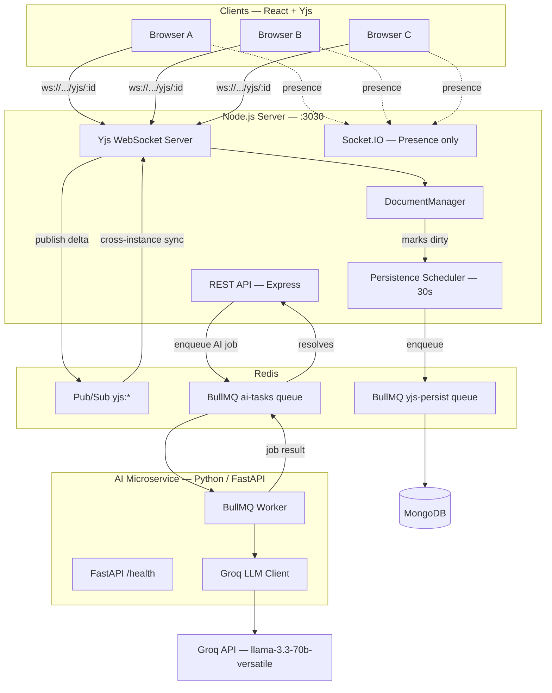
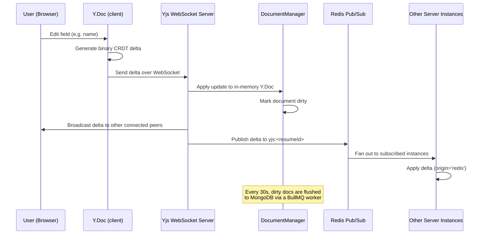
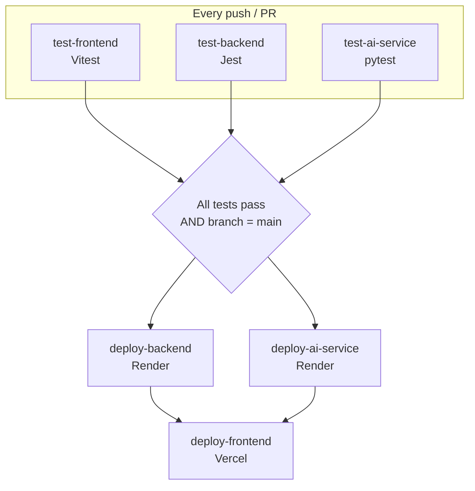

# ResumeBuilder

A full-stack, real-time collaborative resume builder with conflict-free multiplayer editing, AI-powered suggestions, ATS scoring, and one-click portfolio deployment.

Multiple users can edit the same resume at the same time — edits merge automatically with zero conflicts and zero data loss, powered by [Yjs](https://yjs.dev/) CRDTs.

---


## Features

| Feature | Description |
|---|---|
| **Live Collaboration** | Multiple users edit the same resume simultaneously. Changes merge conflict-free using Yjs CRDTs |
| **Offline Editing** | Resume data is cached in IndexedDB. Edits made offline sync automatically on reconnect via a State Vector handshake |
| **AI Suggestions** | An isolated Python microservice calls Groq (`llama-3.3-70b-versatile`) to rewrite bullet points for internships, projects, skills, and more |
| **ATS Scorer** | Scores your resume against SDE job criteria and surfaces specific improvements |
| **Portfolio Deploy** | One click deploys a personal portfolio website to Vercel, sourced from your resume data |
| **Resume Templates** | Three templates: IIT KGP, ISI, John Doe (more can be added) |
| **Presence Awareness** | See who else is currently editing the document with live online/offline status |
| **Google OAuth** | Sign in with Google or email/password |
| **CI/CD** | GitHub Actions runs the full test suite on every push/PR and auto-deploys backend, AI service, and frontend from `main` |

---

## Architecture at a Glance

**System components**



**Real-time edit flow (hot path — zero DB writes)**



For the full breakdown (DocumentManager internals, legacy migration, security model, file map), see [`docs/ARCHITECTURE.md`](docs/ARCHITECTURE.md).

---

## Monorepo Structure

```
resumebuilder/
├── .github/
│   └── workflows/
│       └── pipeline.yml      # GitHub Actions: test + deploy
├── backend/                  # Node.js + Express + Socket.IO + Yjs WebSocket server
├── frontend/                 # React + Vite + Yjs client
├── microservices/
│   └── ai-service/           # Python + FastAPI + BullMQ worker (AI suggestions & ATS scoring)
└── docs/                     # Architecture and feature documentation
```

---

## Tech Stack

| Layer | Technology | Role |
|---|---|---|
| **Frontend** | React 19, Vite | UI rendering, form components |
| **CRDT** | Yjs | Conflict-free replicated data types |
| **Frontend Sync** | y-websocket | WebSocket provider for Yjs |
| **Offline Cache** | y-indexeddb | Browser-side persistence for offline editing |
| **Backend Runtime** | Node.js, Express 5 | HTTP API server |
| **WebSocket** | ws (native) | Binary Yjs sync protocol transport |
| **Presence** | Socket.IO + Redis Adapter | User join/leave notifications |
| **Sync Protocol** | y-protocols | Yjs binary encoding/decoding (sync + awareness) |
| **Message Bus** | Redis Pub/Sub | Cross-instance CRDT delta fanout |
| **Job Queue** | BullMQ + ioredis / bullmq-python | Background persistence & AI job dispatch |
| **Database** | MongoDB (Mongoose) | Cold storage for resume documents |
| **AI Microservice** | Python, FastAPI, uvicorn | Isolated AI processing service |
| **AI Runtime** | Groq API (`llama-3.3-70b-versatile`) | LLM-based ATS scoring & suggestions |
| **File Storage** | Cloudinary | Profile/logo image uploads |
| **Portfolio Deploy** | GitHub API (Octokit) + Vercel API | Deploy pipeline for generated portfolios |
| **Auth** | JWT, Google OAuth 2.0 | Stateless authentication |
| **CI/CD** | GitHub Actions | Test + deploy automation |
| **Testing** | Vitest, Jest, pytest | Frontend, backend, and AI service test suites |

---

## CI/CD Pipeline

Every push and pull request runs the full test suite across all three services. Merges to `main` that pass automatically deploy to production.



- **test-frontend** — Vitest + React Testing Library (unit + integration smoke test)
- **test-backend** — Jest + Supertest against a testable Express app factory (`app.js`)
- **test-ai-service** — pytest, fully isolated (Groq calls auto-mocked in `conftest.py`, no Redis required)
- **deploy-backend** / **deploy-ai-service** — fire the respective Render deploy hook, run in parallel once tests pass on `main`
- **deploy-frontend** — runs only after both Render deploys succeed; deploys via the Vercel CLI

Required GitHub Actions secrets: `RENDER_DEPLOY_HOOK_URL`, `RENDER_DEPLOY_HOOK_URL_AI`, `VERCEL_TOKEN`, `VERCEL_ORG_ID`, `VERCEL_PROJECT_ID`. Full setup steps, troubleshooting, and how to obtain each secret live in [`docs/CICD_SETUP.md`](docs/CICD_SETUP.md).

---

## Deployment Architecture

| Service | Platform | Deploy Trigger | Deployment Model |
|---|---|---|---|
| Backend (Node.js) | Render | Deploy hook fired by `deploy-backend` | Standard Render redeploy of the web service |
| AI Microservice (Python) | Render | Deploy hook fired by `deploy-ai-service` | Standard Render redeploy of the web service |
| Frontend (React/Vite) | Vercel | Vercel CLI deploy fired by `deploy-frontend` | **Blue-green** — Vercel builds and fully warms the new deployment before atomically cutting traffic over, with instant rollback to the previous deployment if needed |

Backend and AI service deploys run in parallel on Render; the frontend only deploys to Vercel once both are confirmed live, so the client is never shipped ahead of an API it depends on.

---

## Getting Started

### Prerequisites
- Node.js ≥ 18
- MongoDB instance
- Redis instance
- GitHub personal access token (for portfolio deploy)
- Vercel API token (for portfolio deploy)
- Groq API key (for AI suggestions & ATS scoring)

### Backend

```bash
cd backend
cp .env.example .env   # fill in your secrets
npm install
npm run dev
```

### AI Microservice

```bash
cd microservices/ai-service
cp .env.example .env   # fill in your secrets
pip install -r requirements.txt
uvicorn app:app --reload --port 8000
```

### Frontend

```bash
cd frontend
npm install
npm run dev
```

Set `VITE_BACKEND_URL` in `frontend/.env` to point at your backend.

### Running Tests Locally

```bash
# Frontend (Vitest)
cd frontend && npm test

# Backend (Jest)
cd backend && npm test

# AI Service (pytest — no Redis or Groq key required)
cd microservices/ai-service && pytest test_app.py
```

For CI/CD activation (GitHub Actions secrets, Render/Vercel setup), see [`docs/CICD_SETUP.md`](docs/CICD_SETUP.md).

---

## Documentation

| Doc | Description |
|---|---|
| [System Design](docs/SYSTEM_DESIGN.md) | End-to-end architecture, data flow diagrams, scaling strategy |
| [Real-Time Collaboration](docs/COLLABORATION.md) | How Yjs CRDTs, WebSocket sync, and presence awareness work |
| [Portfolio Deployment](docs/PORTFOLIO_DEPLOY.md) | The full GitHub → Vercel deploy pipeline |
| [CI/CD Setup](docs/CICD_SETUP.md) | GitHub Actions pipeline, secrets, and troubleshooting |
| [Architecture (legacy)](docs/ARCHITECTURE.md) | Original detailed CRDT architecture reference |

---

## License

MIT